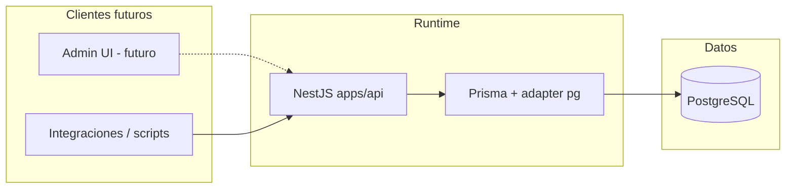

# System Architecture — Product Data Platform

## Arquitectura actual

- **API:** NestJS, un módulo de dominio activo (`ProductsModule`) más `AppController` raíz.
- **Acceso a datos:** `PrismaService` extiende `PrismaClient` con `@prisma/adapter-pg` y pool `pg`.
- **Datos:** PostgreSQL 15 (imagen Alpine) en desarrollo local; producción objetivo alineada a `.env.example` (Supabase / pooler).

## Estructura del monorepo

| Ruta | Responsabilidad |
|------|-----------------|
| `apps/api` | API HTTP, Prisma schema, seed, tests unitarios/e2e. |
| `packages/*` | Código compartido y herramientas; hoy `packages/data-tools` (Python + CSV de normalización). |
| `data/raw` | Fuentes JSON de referencia / importación (no consumidas directamente por la API en runtime). |
| `.github/workflows` | CI (Node 22, pnpm 10). |
| `docker-compose.yml` | Postgres + Redis para entorno local. |
| `docs/` | Documentación de producto, arquitectura y ADRs. |

## Flujos: local / desarrollo / producción

### Local (documentado en README raíz)

1. `pnpm install` en la raíz del monorepo.
2. `docker-compose up -d` → Postgres en `localhost:5435`, Redis en `6380`.
3. `cd apps/api` → `pnpm dlx prisma db push` (sincroniza esquema sin historial de migraciones en el flujo documentado).
4. `pnpm run start:dev` en `apps/api` → API en `PORT` (default `3000`).

### CI

- Disparadores: `push` y `pull_request` a `main` y `develop`.
- Pasos: `pnpm install --frozen-lockfile`, `pnpm lint`, `pnpm typecheck`, `pnpm test --if-present`, `pnpm build` (scripts definidos en workspaces; la API expone lint/typecheck/test/build).

### Producción (objetivo, no codificado de extremo a extremo)

- Base gestionada (p. ej. Supabase PostgreSQL) con `DATABASE_URL` / `DIRECT_URL` según `.env.example`.
- Despliegue del contenedor o servicio Node no está definido en este repo; queda fuera del alcance de archivos actuales.

## Decisiones técnicas relevantes

| Decisión | Detalle |
|----------|---------|
| **pnpm workspaces** | Un solo lockfile y comandos recursivos desde la raíz. |
| **Prisma driver adapters** | `previewFeatures = ["driverAdapters"]` + `PrismaPg` para integración explícita con `pg.Pool`. |
| **JSON para atributos** | `Product.attributes` como `Json?` evita tablas EAV hasta que el dominio lo exija. |
| **data-tools separado** | Normalización y revisión fuera del hot path de la API, coherente con gobernanza manual. |

## Riesgos

| Riesgo | Impacto | Mitigación sugerida |
|--------|---------|---------------------|
| **URL de base de datos hardcodeada** en `PrismaService` | Rotura en otros entornos; fuga de convención de secretos | Leer `process.env.DATABASE_URL` (y cerrar pool en shutdown). |
| **Sin validación de DTO** (`any`, DTOs vacíos) | Datos inválidos en DB, superficie de error amplia | Pipes de validación + DTOs alineados a Prisma. |
| **Sin auth** | Cualquier cliente con red puede mutar catálogo si la API es expuesta | Guards + JWT cuando el modelo de usuario exista. |
| **`db push` en docs vs migraciones** | Deriva entre entornos | Adoptar `prisma migrate` en CI/CD y documentar. |
| **Redis sin uso** | Confusión operativa y costo de mantener servicio ocioso | Usar para caché/rate-limit o retirar del compose hasta que haya caso de uso. |

---

*Referencias de código: `apps/api/src`, `apps/api/prisma/schema.prisma`, `docker-compose.yml`, `.github/workflows/ci.yml`.*
